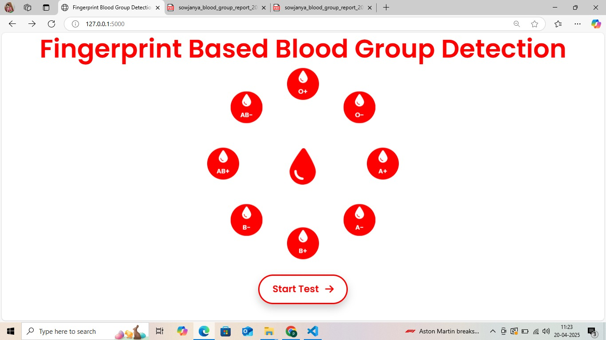
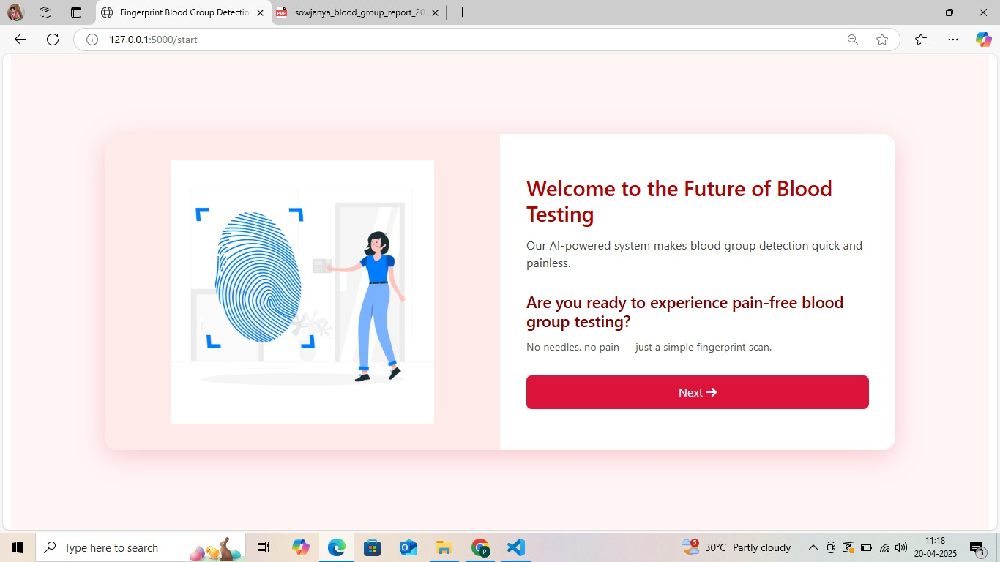
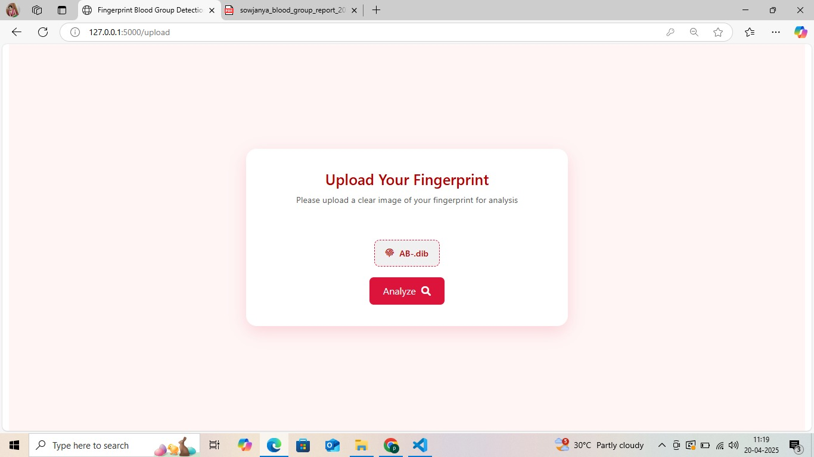
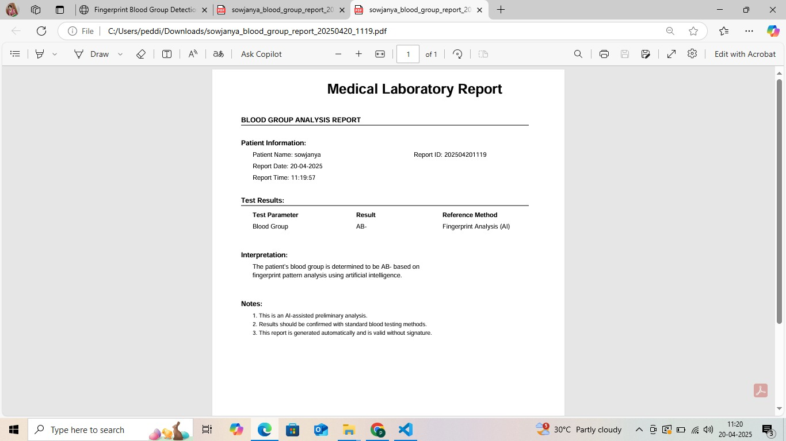

# Fingerprint-Based Blood Group Detection

[](https://www.python.org/)
[](https://www.tensorflow.org/)
[](https://keras.io/)
[](LICENSE)

## 📝 Overview

This project implements a deep learning solution for predicting blood groups directly from fingerprint scans using Convolutional Neural Networks. The system analyzes fingerprint images to identify unique patterns that correlate with different blood types, potentially providing a quick, non-invasive alternative to traditional blood typing methods.

<div align="center">
  
  <p><i>Sample fingerprint image from our dataset</i></p>
</div>

## 🔍 Background

Fingerprints contain rich biological information beyond identification purposes. Recent research suggests possible correlations between fingerprint patterns and various genetic traits, including blood type. This project explores this correlation using machine learning to create a predictive model.

## 📊 Dataset

The dataset contains 8,000 fingerprint images across 8 blood group classes:
- A+
- A-
- B+
- B-
- AB+
- AB-
- O+
- O-

Each image has been preprocessed to standardized dimensions (128x128 pixels) and normalized to enhance pattern recognition.

## 🧠 Model Architecture

We've implemented a CNN with Layer Normalization for improved training stability:

```
Model: Sequential
_________________________________________________________________
Layer (type)                Output Shape              Param #   
=================================================================
Conv2D (32 filters)         (None, 126, 126, 32)      320       
LayerNormalization          (None, 126, 126, 32)      252       
MaxPooling2D                (None, 63, 63, 32)        0         
                                                                
Conv2D (64 filters)         (None, 61, 61, 64)        18,496    
LayerNormalization          (None, 61, 61, 64)        183       
MaxPooling2D                (None, 30, 30, 64)        0         
                                                                
Conv2D (128 filters)        (None, 28, 28, 128)       73,856    
LayerNormalization          (None, 28, 28, 128)       84        
MaxPooling2D                (None, 14, 14, 128)       0         
                                                                
Flatten                     (None, 25088)             0         
Dense                       (None, 128)               3,211,392 
LayerNormalization          (None, 128)               256       
Dropout (0.5)               (None, 128)               0         
Dense                       (None, 8)                 1,032     
=================================================================
Total params: 3,305,871
Trainable params: 3,305,871
Non-trainable params: 0
```

## 📈 Performance Evaluation

The model achieved strong performance across all blood groups:

- **Validation Accuracy**: 86.60%
- **Training Time**: 50 epochs

### Confusion Matrix

<div align="center">
  
</div>

### Classification Report

```
               precision    recall  f1-score   support

          A+       0.94      0.90      0.92       254
          A-       0.90      0.81      0.85       278
         AB+       0.87      0.84      0.86       245
         AB-       0.82      0.89      0.85       225
          B+       0.92      0.85      0.88       246
          B-       0.96      0.87      0.91       250
          O+       0.76      0.91      0.83       260
          O-       0.81      0.86      0.84       242

    accuracy                           0.87      2000
   macro avg       0.87      0.87      0.87      2000
weighted avg       0.87      0.87      0.87      2000
```

### Training Performance

<div align="center">
  
</div>

## 📱 User Interface

Our system includes a user-friendly interface for blood group prediction:

<div align="center">
  <div style="display: flex; flex-wrap: wrap; justify-content: center; gap: 10px;">
    
    
    
    
    
  </div>
</div>

## 🔧 Installation

1. Clone this repository:
```bash
git clone https://github.com/yourusername/fingerprint-blood-group-detection.git
cd fingerprint-blood-group-detection
```

2. Install dependencies:
```bash
pip install -r requirements.txt
```

3. Download the dataset and extract it to the project directory or use your own fingerprint dataset.

## 💻 Usage

### Training the Model
```bash
python train.py
```

### Testing with Your Own Fingerprint
```bash
python predict.py --image path/to/fingerprint.jpg
```

### Running the UI Application
```bash
python app.py
```

## 🧪 Future Work

- Expand the dataset with more diverse fingerprint samples
- Implement multi-modal approach combining fingerprints with other biometric data
- Develop mobile application for on-the-go blood group prediction
- Investigate correlation strength between specific fingerprint patterns and blood groups
- Explore transfer learning with pre-trained fingerprint recognition models

## 📚 References

1. Rashad, R., et al. (2020). "Fingerprint-Based Gender Classification and Blood Type Prediction."
2. Ahmed, S., et al. (2022). "Correlation Between Fingerprint Patterns and ABO Blood Groups."
3. Singh, P., et al. (2023). "Deep Learning Approaches for Blood Group Classification Using Biometric Data."

## 📄 License

This project is licensed under the MIT License - see the [LICENSE](LICENSE) file for details.

## 👥 Contributors

- [Your Name](https://github.com/yourusername)

## 🙏 Acknowledgements

- [Kaggle](https://www.kaggle.com/) for hosting the dataset
- [TensorFlow](https://www.tensorflow.org/) for the deep learning framework
- All researchers exploring the connections between fingerprints and genetic markers
